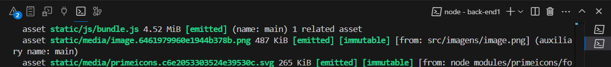

## Trabalho de LPIII

### Projeto: Patrocínios para Peças Musicais

**Linguagem de Programação III – Guilherme Silva Sampaio**

### Título do Projeto

Patrocínios para Peças Musicais

### Entidades e Relacionamentos

- **Usuário**
  - Maestro (proponente)
  - Patrocinador (interessado)
- **Relacionamentos**
  - Maestro [1:n] PeçaMusical
  - Patrocinador [1:n] Patrocínio
  - Patrocínio : Patrocinador - PeçaMusical

### Entidades, Atributos e Referências

- **Usuário**
  - Atributos: cpf, nome, email, perfil, status, senha, questão, resposta, cor_tema
  - Maestro: nacionalidade, anos_experiência, estilo, peças_musicais, usuário
  - Patrocinador: email, tipo, telefone, patrocínios, usuário
- **PeçaMusical**
  - Atributos: id, título, duração, tom, gênero, maestro, patrocínios
- **Patrocínio**
  - Atributos: id, orçamento_disponível, data_possível, peça_musical, patrocinador

### Enumerados

- **Usuário**
  - Perfil: maestro, patrocinador
  - Status: ativo, inativo, pendente
  - Cores: amarelo, anil, azul, azul_piscina, cinza_escuro, laranja, rosa, roxo, verde, verde_azulado
- **Maestro**
  - Nacionalidade: brasileiro, estrangeiro
  - Estilo: simples, elegante
- **Patrocinador**
  - Tipo: pessoa_física, empresa
- **PeçaMusical**
  - Estilo: rock, pop, clássica

### Filtros: Administrar e Pesquisar

- **Maestro**
  - Administrar Peças Musicais: título, categoria, repertório, orçamento_estimado
  - Pesquisar Patrocínios: nome_patrocinador, título_proposta, categoria_proposta, orçamento_disponível
- **Patrocinador**
  - Administrar Patrocínios: nome_maestro, categoria_proposta, título_proposta, orçamento_estimado
  - Pesquisar Peças Musicais: nome_maestro, título, categoria, repertório, orçamento_estimado

## Rodar o projeto

### Pré-requisitos

- Node.js instalado (v22)
- Yarn instalado

### Instalando o nvm no Windows - facilita mudar de versão do node caso tenha outra versão na máquina

Para instalar o nvm no Windows, siga os passos abaixo:

1. Baixe o instalador do nvm para Windows a partir do [repositório oficial](https://github.com/coreybutler/nvm-windows/releases).
2. Execute o instalador e siga as instruções na tela.
3. Após a instalação, abra um novo terminal e execute o comando abaixo para verificar se o nvm foi instalado corretamente:

   ```sh
   nvm version
   ```

### Instalando o Node.js v22

Para instalar a versão 22 do Node.js, execute o seguinte comando:

```sh
nvm install 22
```

Para usar a versão 22 do Node.js, execute:

```sh
nvm use 22
```

### Instalando o Yarn globalmente

Para instalar o Yarn globalmente, execute o seguinte comando:

```sh
npm install -g yarn
```

### Dica: para abrir o terminal no VS Code: `Ctrl + "`

Clicando no `+`, é possível usar mais de um terminal ao mesmo tempo, facilitando a navegação entre os diretórios e a execução dos comandos.



### Passos

1. Abra os dois diretórios do projeto e instale as dependências:

   ```sh
   cd /c:/LPIII/front-end1
   ```

   ```sh
   cd /c:/LPIII/back-end1
   ```

2. Instale as dependências do projeto (em cada diretório, um por vez):

   ```sh
   yarn install
   ```

3. Execute o comando para iniciar a aplicação web (esteja no diretório do backend):

   ```sh
   yarn web
   ```

4. Abra o navegador e acesse:

   ```sh
   http://localhost:3000
   ```
